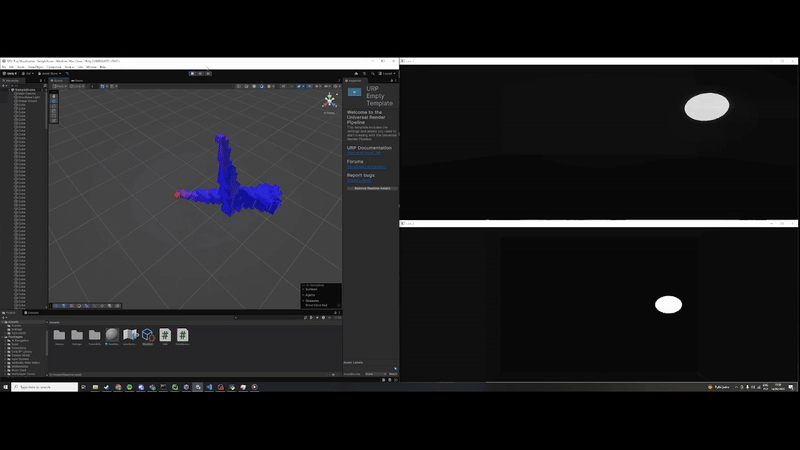
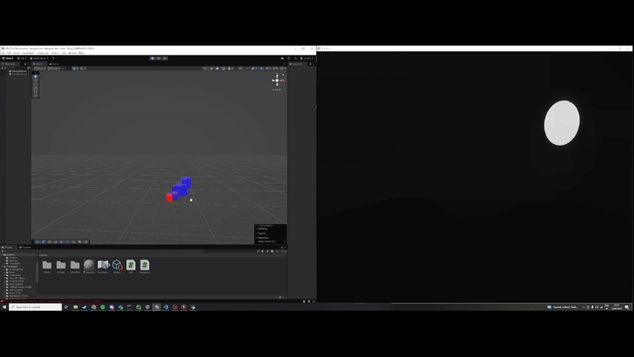
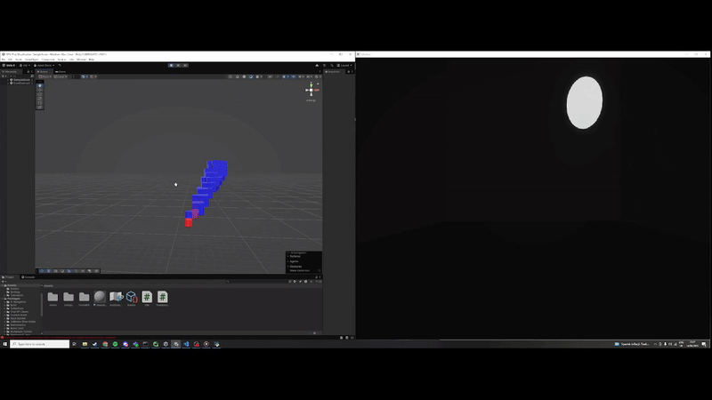
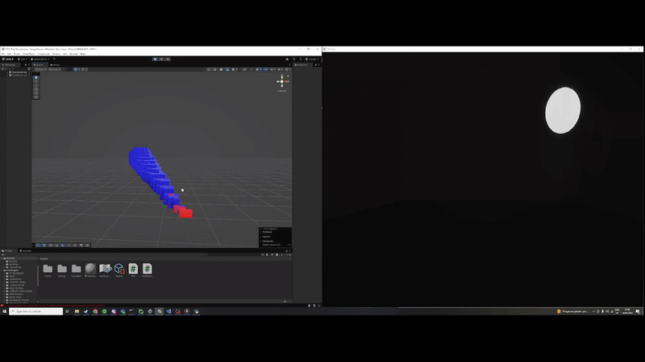

# Tracking objects from camera images using cuda

This project leverages cuda to track objects from camera images in a 3d space
This [youtube](
) video was a big inspiration for this project and the algorithms we implemented

We also support different voxel space dimensions and units

## 10x10

## 25x25

## 50x50
